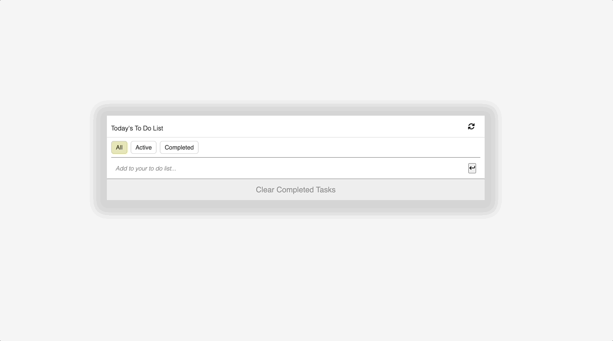
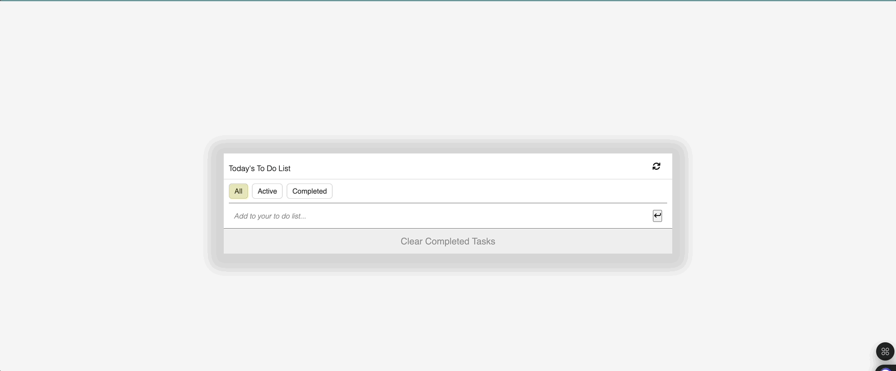

# 📝 React ToDo List

A simple, responsive ToDo list application built with vanilla JavaScript and Webpack, featuring task management with filtering, inline editing, and local storage persistence.

## 🎥 Demo

### Basic Functionality


### Advanced Features


## ✨ Features

- ✅ **Add Tasks**: Quickly add new tasks to your todo list
- 🗑️ **Delete Tasks**: Remove tasks with a single click
- ✏️ **Inline Editing**: Double-click any task to edit it directly
- ☑️ **Mark Complete**: Check off completed tasks
- 🔍 **Filter Tasks**: View All, Active, or Completed tasks
- 🧹 **Clear Completed**: Remove all completed tasks at once
- 📱 **Responsive Design**: Works perfectly on desktop and mobile
- 💾 **Local Storage**: Your tasks persist between sessions

## 🛠️ Tech Stack

- **JavaScript (ES6+)**: Modern JavaScript with classes and modules
- **HTML5**: Semantic markup structure
- **CSS3**: Responsive design with Flexbox
- **Webpack**: Module bundling and development server
- **Font Awesome**: Icons for better UX

## 🚀 Getting Started

### Prerequisites

- Node.js (v14 or higher)
- npm or yarn package manager

### Installation

1. **Clone the repository**
   ```bash
   git clone https://github.com/your-username/React-ToDo.git
   cd React-ToDo
   ```

2. **Install dependencies**
   ```bash
   npm install
   ```

3. **Start development server**
   ```bash
   npm start
   ```

4. **Open your browser**
   Navigate to `http://localhost:8080`

### Build for Production

```bash
npm run build
```

## 🎯 Usage

### Adding Tasks
- Type your task in the input field
- Press Enter or click the arrow button to add

### Managing Tasks
- **Edit**: Double-click any task text or click the pencil icon
- **Delete**: Click the trash icon next to any task
- **Complete**: Click the checkbox to mark tasks as done
- **Filter**: Use the All/Active/Completed buttons to filter your view

### Keyboard Shortcuts
- **Enter**: Save changes when editing a task
- **Escape**: Cancel editing (focus away from input)

## 📁 Project Structure

```
React-ToDo/
├── src/
│   ├── index.html          # Main HTML template
│   ├── index.js           # Entry point and event handlers
│   ├── style.css          # All styles and responsive design
│   ├── methods.js         # Core TodoList class and methods
│   ├── interactive.js     # User interaction handlers
│   └── datalist.js        # Data model class
├── dist/                  # Built files (auto-generated)
├── webpack.config.js      # Webpack configuration
├── package.json          # Dependencies and scripts
└── README.md             # This file
```

## 🔧 Key Components

### TodoList Methods (`methods.js`)
- `addLists()` - Add new tasks
- `showLists()` - Render filtered tasks
- `deleteListDataByIndex()` - Remove tasks
- `setFilter()` - Filter task display
- `inlineEditHandlers()` - Handle double-click editing

### Interactive Features (`interactive.js`)
- Checkbox state management
- Clear completed functionality
- Event delegation for dynamic content

## 🎨 Styling Features

- **Mobile-first responsive design**
- **Smooth hover effects** on buttons
- **Clean, minimalist interface**
- **Accessible color contrast**
- **Touch-friendly button sizes**

## 📱 Responsive Breakpoints

- **Desktop**: Full-width layout with comfortable spacing
- **Mobile (≤600px)**: Optimized for touch interaction
  - 95% width container
  - Larger touch targets
  - Stacked filter buttons

## 🔮 Future Enhancements

- [ ] Drag and drop task reordering
- [ ] Task categories/tags
- [ ] Due dates and reminders
- [ ] Dark mode toggle
- [ ] Cloud sync/backup
- [ ] Keyboard navigation
- [ ] Task priority levels
- [ ] Bulk task operations

## 🤝 Contributing

Contributions are welcome! Please feel free to submit a Pull Request.

1. Fork the project
2. Create your feature branch (`git checkout -b feature/AmazingFeature`)
3. Commit your changes (`git commit -m 'Add some AmazingFeature'`)
4. Push to the branch (`git push origin feature/AmazingFeature`)
5. Open a Pull Request

## 📄 License

This project is licensed under the MIT License - see the [LICENSE](LICENSE) file for details.

## 🙏 Acknowledgments

- Font Awesome for the beautiful icons
- Webpack community for excellent tooling
- Modern JavaScript features that make development enjoyable

## 🐛 Known Issues

If you encounter any issues, please check:
1. Node.js version compatibility
2. Browser localStorage availability
3. Console errors for debugging

## 📞 Support

If you have any questions or need help, feel free to:
- Open an issue on GitHub
- Contact the maintainer

---

⭐ **Star this repo if you found it helpful!**
